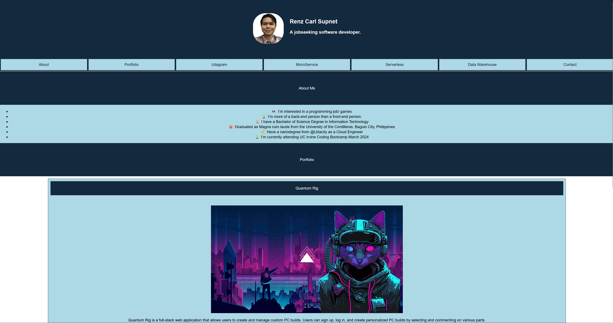

# My_Portfolio

## Description

A simple html/css portfolio website to showcase what I have learned after week 2 of attending the UCI Coding Bootcamp. It focuses on responsive css such as the use of display:flex.

## Screenshot

Below shows a screenshot of the website deployed @ https://renzsupnet.github.io/My_Portfolio/

## Highlights

Added CSS attributes such as display:flex, .card:hover, box-shadow, etc. to make it responsive.

For example:

Adding .card:hover { flex: 2 0 0} makes the card larger relative to the other
